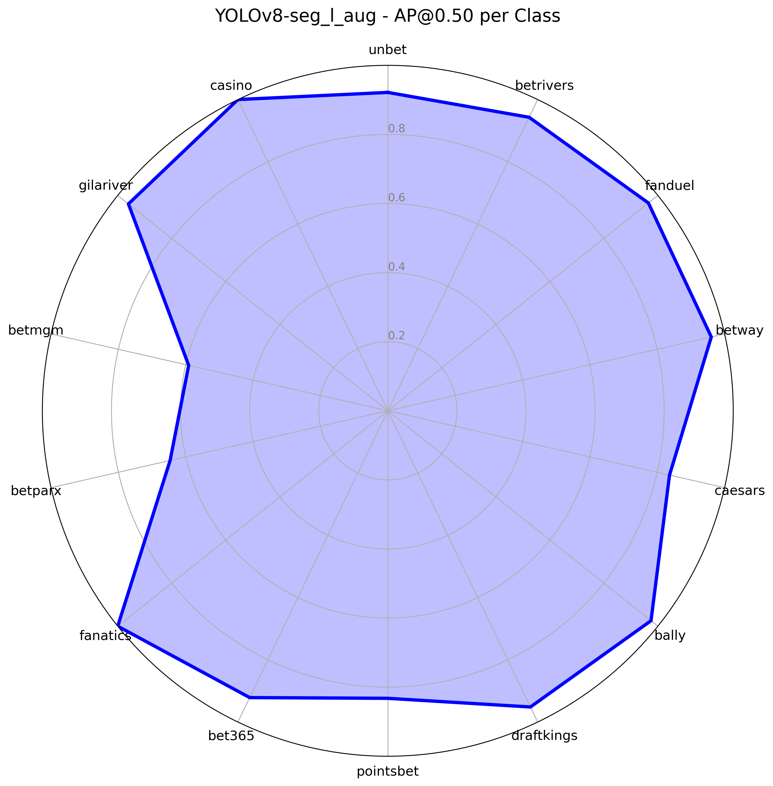
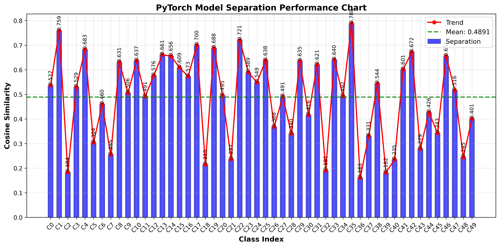

# EVEMASK v1.0.0

<div align="center">


**Real-Time NBA Tournaments Betting Logo Segmentation and Masking Module**

[](LICENSE)

</div>

---

## Table of Contents

- [About](#-about)
- [Features](#-features)
- [Team](#-team)
- [Installation](#-installation)
- [Quick Start](#-quick-start)
- [Usage](#-usage)
- [Architecture](#-architecture)
- [Configuration](#️-configuration)
- [Project Structure](#-project-structure)
- [API Documentation](#-api-documentation)
- [Performance](#-performance)
- [Testing](#-testing)
- [License](#-license)

---

## About

**EVEMASK v1.0.0** is a high-performance, real-time video processing system designed for intelligent content analysis and automated moderation. Leveraging cutting-edge AI models, EVEMASK can accurately detect, segment, and classify visual elements in live video streams with exceptional speed and precision.

In the context of the NBA (National Basketball Association), advertisements from betting companies are commonly displayed on player jerseys, courtside LED boards, and digital overlays. This presents a major challenge for Vietnamese broadcasters, as all forms of gambling and betting promotion are strictly prohibited on mass media under current regulations.

EVEMASK offers a powerful solution: real-time detection and blurring of restricted content during live broadcasts. This ensures legal compliance without compromising viewer experience or broadcast quality. With EVEMASK, airing NBA games becomes safe, seamless, and professional, enabling broadcasters to deliver international sports content while adhering to local content regulations.

### Key Capabilities

- **Real-time Object Detection & Segmentation**: YOLOv8-based segmentation for precise object boundaries
- **Intelligent Classification**: Feature extraction and similarity matching for object classification
- **Content Moderation**: Conditional blurring based on object classes
- **High Performance**: TensorRT optimization for GPU-accelerated inference
- **Dynamic Processing**: Adaptive frame skipping and batch processing
- **System Monitoring**: Real-time resource tracking and performance metrics

### Use Cases

- **Content Moderation**: Automated detection and blurring of sensitive content
- **Brand Recognition**: Identify and classify brand logos in video streams
- **Quality Control**: Monitor video content for compliance and standards
- **Real-time Analytics**: Extract insights from live video feeds
- **Broadcasting**: Live content filtering for television and streaming platforms
- **Security**: Automated surveillance with intelligent object detection

---

## Features

### Performance Optimizations
- **TensorRT Engine**: GPU-accelerated inference with FP16 precision
- **Dynamic Batching**: Adaptive batch sizes for optimal throughput
- **Circular Queue**: Efficient frame buffering with automatic memory management
- **Multi-threading**: Parallel processing of capture, AI, and output streams
- **Memory Optimization**: Automatic cleanup and efficient buffer usage
- **Frame Skipping**: Intelligent frame selection for real-time processing

### AI Capabilities
- **Segmentation**: State-of-the-art object detection and segmentation
- **Feature Extraction**: Embedding generation for classification
- **Similarity Matching**: FAISS-based nearest neighbor search
- **Conditional Blurring**: Intelligent content masking based on object classes
- **Multi-class Support**: Configurable classification categories
- **Confidence Thresholding**: Adjustable detection sensitivity

### Streaming Support
- **Multiple Protocols**: UDP, RTSP, RTMP input/output support
- **Real-time Processing**: Sub-second latency for live streams
- **FPS Control**: Configurable target frame rates
- **Stream Validation**: Built-in connectivity testing tools
- **Network Optimization**: Packet size configuration for UDP streams
- **Error Recovery**: Automatic reconnection and stream recovery

### System Monitoring
- **Resource Tracking**: CPU, GPU, memory, and network monitoring
- **Performance Metrics**: FPS, latency, and throughput measurement
- **Health Monitoring**: Automatic system status reporting
- **Comprehensive Logging**: Detailed logging with timestamps and levels
- **Live Display**: Real-time system status dashboard
- **Alert System**: Automatic notifications for system issues

---

## Team

**EVEMASK Team** - AI Research & Development Group

### Product Information
- **Product Name**: EVEMASK
- **Version**: 1.0.0
- **Development Period**: 2025
- **Technology Stack**: Python, PyTorch, TensorRT, OpenCV, FAISS
- **License**: Commercial License (Proprietary)

### Contact
- **Email**: [evemask.ai@gmail.com](mailto:evemask.ai@gmail.com)
- **Website**: [https://evemask.com](https://evemask.com)

---

## Installation

### Prerequisites

- **Python**: 3.9 or higher
- **CUDA**: 11.8 or higher (for GPU acceleration)
- **TensorRT**: 8.6.1
- **NVIDIA GPU**: Compatible with TensorRT 8.6.1
- **Git**: For cloning the repository

### System Requirements

- **OS**: Windows 10/11, Linux (Ubuntu 20.04+)
- **RAM**: 8GB minimum, 16GB recommended
- **GPU**: NVIDIA GPU with 6GB+ VRAM (RTX 4050 or better recommended)
- **Storage**: 10GB free space for models and data
- **Network**: Stable internet connection for model downloads

### Installation Steps

1. **Clone the repository**
```bash
git clone ....
cd PIPELINE
```

2. **Create virtual environment**
```bash
# Windows
python -m venv evemask_env
evemask_env\Scripts\activate

# Linux/Mac
python -m venv evemask_env
source evemask_env/bin/activate
```

3. **Install dependencies**
```bash
pip install -r requirements.txt
```

4. **Verify CUDA installation**
```bash
python -c "import torch; print(f'CUDA available: {torch.cuda.is_available()}')"
python -c "import tensorrt; print(f'TensorRT version: {tensorrt.__version__}')"
```

5. **Test installation**
```bash
python tester/run_all_tests.py
```

## Quick Start

### 1. Model Preparation

Download model
```bash
# model 1
gdown "https://drive.google.com/uc?id=1LAAAnlKMrrZ30Eavmkji66Y_LTw70vwj" -O "weights/yolo/seg_v1.0.0.pt"

#model 2
gdown "https://drive.google.com/uc?id=1xYHOLLgcnWaRk-LFXb-U34Nmhn9x4W0q" -O "weights/pytorch/fe_v1.0.0.pt"
```
Get pytorch model
```bash
# Extract PyTorch model from Ultralytics format
python getpytorch.py --weights weights/yolo/seg_v1.0.0.pt --output weights/pytorch/seg_v1.0.0.pth
```

Export to ONNX format
```bash
#model 1
python export.py --pth weights/pytorch/seg_v1.0.0.pth --output weights/onnx/seg_v1.0.0.onnx --input-shape 1 3 640 640 --input-name input --output-names pred0 pred1_0_0 pred1_0_1 pred1_0_2 pred1_1 pred1_2 --mode float32bit --device cuda --opset 19 --typeModel seg

#model 2
python export.py --pth weights/pytorch/fe_v1.0.0.pt --output weights/onnx/fe_v1.0.0.onnx --input-shape 1 3 224 224 --input-name input --output-names output --mode float16bit --device cuda --opset 12 --typeModel fe
```
[option] Download Onnx model
```bash
# model 1 base
gdown "https://drive.google.com/uc?id=19k8U0gEqpI3Gnr2-94o4dohVyAsX1TD9" -O "weights/onnx/seg_v1.0.0.onnx"

# model 1 trimmed
gdown "https://drive.google.com/uc?id=1JceHvPMsNtS-oY0m2D4k687hy_yFOaNA" -O "weights/onnx/seg_v1.0.0_trimmed.onnx"

#model 2
gdown "https://drive.google.com/uc?id=1XIKXj8976WjxfFwoWDPLx_aysmvQmb6p" -O "weights/onnx/fe_v1.0.0.onnx"
```

Build TensorRT engine

```bash
#model 1
python build.py --onnx weights/onnx/seg_v1.0.0_trimmed.onnx --engine weights/trtPlans/seg_v1.0.0_trimmed.trt --fp16 --dynamic --dynamic-shapes "{\"input\": ((1, 3, 640, 640), (2, 3, 640, 640), (3, 3, 640, 640))}"

#model 2
python build.py --onnx weights/onnx/fe_v1.0.0.onnx --engine weights/trtPlans/fe_v1.0.0.trt --fp16 --dynamic --dynamic-shapes "{\"input\": ((1,3,224,224), (8,3,224,224), (32,3,224,224))}"
```

### 2. Configuration Setup

Edit `cfg/default.yaml` to configure your streams:

```yaml
# Basic configuration
INPUT_SOURCE: "udp://224.1.1.1:30122?pkt_size=1316"
OUTPUT_TYPE: "udp"
OUTPUT_STREAM_URL_UDP: "udp://@225.1.9.254:30133?pkt_size=1316"
TARGET_FPS: 25

# Model paths
segment_model:
  path: "weights/trtPlans/yolov8_seg_aug_best_l_trimmed.trt"
  max_batch_size: 3
  dynamic_factor: 3

extract_model:
  path: "weights/trtPlans/SupConLoss_BBVGG16.trt"
  max_batch_size: 32
  len_emb: 256
```

### 3. Run the Pipeline

```bash
# Start the main pipeline
python main.py

# Monitor system resources
python monitor.py

# Test stream connectivity
python test_stream.py
```

### 4. Verify Operation

The system will display:
- EVEMASK logo and startup information
- Configuration details
- Thread status (Capture, AI, Output)
- Real-time performance metrics
- System health indicators


## Image Generation & Augmentation Tool

You can use the built-in image augmentation tool to automatically generate new images for data augmentation using a variety of transformations (rotation, flip, scale, brightness, contrast, noise, blur, crop, color shift, etc.).

#### Run the tool:

```bash
python src/tools/genImage.py
```

#### What it does:
- Scans the `recognizeData/` directory for subfolders containing images.
- Applies a set of image transformations to each image in the selected folder.
- Saves the generated images in a new folder (e.g., `garden_generated/` if you select the `garden` folder).
- Prints statistics about the number of images generated for each transformation.

#### Customization:
- To change the folder to augment, edit the `selected_folder` variable in `src/tools/genImage.py`:
  ```python
  selected_folder = "bet365"  # Change to your desired folder
  ```
- To use only specific transformations, modify the `selected_transforms` list:
  ```python
  selected_transforms = [
      gen_image.rotate_image,
      gen_image.flip_image,
      gen_image.adjust_brightness,
      gen_image.scale_image
  ]
  ```
- By default, all transformations are applied.
- You can also limit the number of generated images per transformation by changing the `max_images_per_transform` parameter.

#### Output:
- Generated images are saved in a new folder inside `recognizeData/` (e.g., `recognizeData/bet365_generated/`).
- The script prints a summary of how many images were generated for each transformation.

### Advanced Configuration

#### Input Sources
```yaml
# UDP Stream
INPUT_SOURCE: "udp://input..."
```

#### Output Destinations
```yaml
# UDP Stream
OUTPUT_TYPE: "udp"
OUTPUT_STREAM_URL_UDP: "udp://output..."
```

### Model Configuration

The system supports two main models:

1. **Segmentation Model**
   ```yaml
   segment_model:
     path: "weights/trtPlans/seg_v1.0.0.trt"
     max_batch_size: 3
     dynamic_factor: 3
     conf_threshold: 0.5
     iou_threshold: 0.7
   ```

2. **Feature Extraction Model**
   ```yaml
   extract_model:
     path: "weights/trtPlans/fe_v1.0.0.trt"
     max_batch_size: 32
     len_emb: 256
   ```

### Performance Tuning

```yaml
# Batch processing
batch_size: 3

# Detection thresholds
conf_threshold: 0.5
iou_threshold: 0.7

# Frame rate control
TARGET_FPS: 30
DELAY_TIME: 2
```

### Classification Classes

```yaml
names:
  0: "unbet"
  ...

# Classes that should not be blurred
CLASSES_NO_BLUR: [0]
```

---

## Architecture

### System Overview

```
                    ┌─────────────────────────┐
                    │     Input Stream        │
                    │   (Video/Camera Feed)   │
                    └───────────┬─────────────┘
                                │
                                ▼
                    ┌─────────────────────────┐
                    │    Capture Thread       │
                    │  • Read frames          │
                    │  • Frame preprocessing  │
                    │  • Add to queue         │
                    └───────────┬─────────────┘
                                │
                                ▼
    ┌─────────────────────────────────────────────────────────────┐
    │                    Circular Queue                           │
    │  ┌─────┐  ┌─────┐  ┌─────┐  ┌─────┐  ┌─────┐  ┌─────┐       │
    │  │Frame│  │Frame│  │Frame│  │Frame│  │Frame│  │Frame│  ...  │
    │  │  1  │  │  2  │  │  3  │  │  4  │  │  5  │  │  6  │       │
    │  └─────┘  └─────┘  └─────┘  └─────┘  └─────┘  └─────┘       │
    └─────┬─────────────────────────────────────────────┬─────────┘
          │                                             │
          ▼                                             ▼
┌─────────────────────────┐                   ┌─────────────────────────┐
│      AI Thread          │                   │    Output Thread        │
│  • Get frame by ID      │                   │  • Get processed frame  │
│  • TensorRT inference   │                   │  • Check completion     │
│  • Object detection     │                   │  • Send to output       │
│  • Update frame status  │                   └───────────┬─────────────┘
└─────────────────────────┘                               │
          │                                               ▼
          ▼                                  ┌─────────────────────────┐
┌─────────────────────────┐                  │    Output Stream        │
│    TensorRT Engine      │                  │  (Processed Video)      │
│  • GPU acceleration     │                  └─────────────────────────┘
│  • Model inference      │
│  • Result generation    │
└─────────────────────────┘
```

### Core Components

#### 1. Stream Controller (`src/controllers/stream.py`)
- **Purpose**: Manages video capture and output streaming
- **Features**: 
  - One input/output protocol support
  - Frame buffering and synchronization
  - Error handling and recovery
  - Network optimization

#### 2. AI Engine (`src/brain/AI.py`)
- **Purpose**: Coordinates segmentation and feature extraction
- **Features**:
  - Batch processing and frame skipping
  - Conditional blurring and object classification
  - Performance optimization
  - Memory management

#### 3. Circular Queue (`src/controllers/circle_queue.py`)
- **Purpose**: Thread-safe frame buffer with automatic overflow management
- **Features**:
  - Efficient frame retrieval with skipping capabilities
  - Memory management for real-time processing
  - Automatic cleanup and overflow prevention

#### 4. TensorRT Models (`src/models/engine.py`)
- **Purpose**: High-performance GPU inference engines
- **Features**:
  - Dynamic shape support for flexible batch sizes
  - Memory optimization and workspace management
  - FP16 precision for speed optimization

### Processing Pipeline

1. **Frame Capture**: Continuous frame reading from input source
2. **Preprocessing**: Image resizing, normalization, and tensor conversion
3. **Segmentation**: Object detection and mask generation
4. **Feature Extraction**: Embedding generation for detected objects
5. **Similarity Matching**: Similarity matching against reference data
6. **Post-processing**: Conditional blurring and mask application
7. **Output Streaming**: Processed frames sent to output destination

### Thread Architecture

- **Capture Thread**: Dedicated to reading frames from input source
- **AI Thread**: Handles all AI processing and inference
- **Output Thread**: Manages frame output to destination
- **Main Thread**: Coordinates system monitoring and user interaction

---

## Configuration

### Main Configuration (`cfg/default.yaml`)

```yaml
# =========================
# Default Configuration File for EVEMASK Pipeline
# =========================

# List of class indices that are considered "no blur" (possibly for filtering or post-processing)
CLASSES_NO_BLUR:
- 0

# Delay time in seconds
DELAY_TIME: 2

# Target frames per second for processing/output
TARGET_FPS: 30

# Batch size for model inference or processing
batch_size: 3

# Input video stream source (UDP multicast address with packet size)
INPUT_SOURCE: udp://input...

# Output stream type (e.g., udp, rtmp, rtsp)
OUTPUT_TYPE: udp

# Output stream URLs for different protocols (set to None if not used)
OUTPUT_STREAM_URL_RTMP: None
OUTPUT_STREAM_URL_RTSP: None
OUTPUT_STREAM_URL_UDP: udp://output...

# Confidence threshold for detection (e.g., for object detection models)
conf_threshold: 0.5

# Intersection-over-union threshold for filtering detections (e.g., NMS)
iou_threshold: 0.7

# Number of classes for detection/segmentation
nc: 14

# Mapping of class indices to class names
names:
  0: unbet
  ...

# Path to directory containing recognition data
recognizeData_path: recognizeData

# Configuration for the segmentation model
segment_model:
  # List of all output tensor names from the model
  all_output_names:
  - pred0
  - pred1_0_0
  - pred1_0_1
  - pred1_0_2
  - pred1_1
  - pred1_2
  # Dynamic factor (could relate to model input scaling or batching)
  dynamic_factor: 3
  # Device to run the model on (e.g., cuda for GPU)
  get_to: cuda
  # List of input tensor names for the model
  input_names:
  - input
  # Maximum batch size supported by the model
  max_batch_size: 3
  # Path to the model weights/plan file
  path: weights/trtPlans/yolov8_seg_aug_best_l_trimmed.trt

# Configuration for the feature extraction model
extract_model:
  # List of input tensor names for the model
  input_names:
  - input
  # Length of the embedding vector output by the model
  len_emb: 256
  # Maximum batch size supported by the model
  max_batch_size: 32
  # List of output tensor names for the model
  output_names:
  - output
  # Path to the model weights/plan file
  path: weights/trtPlans/supconloss_bbresnet50_50e.trt
```

### Configuration Validation

The system automatically validates configuration:
- Model file existence
- Stream URL format
- Parameter ranges
- System compatibility

---

## Project Structure

```
PIPELINE/
├── 📄 main.py                 # Main entry point
├── 📄 monitor.py              # System monitoring
├── 📄 build.py                # TensorRT engine builder
├── 📄 export.py               # PyTorch to ONNX exporter
├── 📄 getpytorch.py           # get pytorch model
├── 📄 requirements.txt        # Python dependencies
├── 📄 README.md               # This file
├── 📄 .gitignore              # Git ignore patterns
│
├── 📁 cfg/
│   └── 📄 default.yaml       # Main configuration file
│
├── 📁 src/
│   ├── 📁 brain/
│   │   └── 📄 AI.py          # Main AI processing engine
│   │
│   ├── 📁 controllers/
│   │   ├── 📄 stream.py      # Stream management
│   │   ├── 📄 frame.py       # Frame processing
│   │   └── 📄 circle_queue.py # Circular buffer
│   │
│   ├── 📁 logger/
│   │   └── 📄 logger.py      # EveMaskLogger
│   │
│   ├── 📁 models/
│   │   ├── 📄 engine.py      # TensorRT inference
│   │   └── 📄 initNet.py     # Model initialization
│   │
│   └── 📁 tools/
│       ├── 📄 utils.py       # Utility functions
│       ├── 📄 vectorPrepare.py # Feature preparation
│       ├── 📄 similarityBlock.py # Similarity matching
│       └── 📄 NB_search.py   # Neighbor search
│
├── 📁 tester/
│   ├── 📄 run_all_tests.py   # Test runner
│   ├── 📄 test_ai.py         # AI module tests
│   ├── 📄 test_stream_controller.py # Stream tests
│   ├── 📄 test_circle_queue.py # Queue tests
│   ├── 📄 test_frame.py      # Frame tests
│   ├── 📄 test_models.py     # Model tests
│   ├── 📄 test_logger.py     # Logger tests
│   ├── 📄 test_utils.py      # Utility tests
│   └── 📄 test_tools_modules.py # Tools tests
│
├── 📁 weights/
│   ├── 📁 yolo/              # YOLOv8 weights
│   ├── 📁 pytorch/           # PyTorch models
│   ├── 📁 onnx/              # ONNX models
│   └── 📁 trtPlans/          # TensorRT engines
│
├── 📁 recognizeData/         # Reference data for classification
├── 📁 videos/                # Test video files
├── 📁 block/                 # Additional resources
└── 📁 moderator/             # Stream moderation tools
```

---

## 🔧 API Documentation

### Core Classes

#### StreamController
```python
from src.controllers import StreamController

# Initialize with configuration
controller = StreamController(config)

# Start capture thread
controller.source_capture()

# Start output thread
controller.out_stream()
```

#### AI Engine
```python
from src.brain import AI

# Initialize AI engine
ai_engine = AI(config, FEmodel=True)

# Run AI processing
ai_engine.run()
```

#### Circular Queue
```python
from src.controllers import CircleQueue

# Initialize queue
queue = CircleQueue(maxsize=1000)

# Add frame
queue.add_frame(frame)

# Get frame
frame = queue.get_by_id(id)
```

#### EveMaskLogger
```python
from src.logger import EveMaskLogger

# Get logger instance
logger = EveMaskLogger.get_instance()

# Log messages
logger.info("Processing started")
logger.error("Error occurred")
logger.warning("Warning message")

# Display system status
logger.display_logo()
logger.show_config(config)
logger.start_live_display(config, capture_alive, output_alive, ai_alive)
```

### Configuration API

```python
import yaml

# Load configuration
config_path = os.path.join(os.path.dirname(__file__), "cfg", "default.yaml")
with open(os.path.abspath(config_path), "r") as f:
    cfg = yaml.safe_load(f)

# Access configuration values
input_source = config["INPUT_SOURCE"]
batch_size = config["batch_size"]
```

---

## Performance

### Benchmarks

Run benchmarks evaluation.
```bash
python benchmarks/evaluator.py
```

**Segmentation AP**


**Separation Score**


**AI Inference Speed - Only**
| Batch Size | RTX3050 4GB | RTX3050ti 4GB |
|--------|-------|-------|
| **1** | 31.0857 FPS | 45.954 FPS |
| **2** | 17.945 FPS | 25.547 FPS |
| **3** | 10.9312 FPS | 17.475 FPS |

**AI Inference Speed - Pipeline**

| Config | PC1 | PC2 |
|--------|-------|-------|
| **CPU** | AMD Ryzen 5 | Intel® Core™ i7-11800H |
| **RAM** | 16GB | 16GB |
| **GPU** | RTX3050 4GB | RTX3050ti 4GB |

| Batch Size | PC1 | PC2 |
|--------|-------|-------|
| **1** | 15.3923 FPS | 19.186 FPS |
| **2** | 14.771 FPS | 18.708 FPS |
| **3** | 13.6473 FPS | 17.475 FPS |

### Performance Optimization Features

- **TensorRT FP16**: 2x speed improvement with minimal accuracy loss
- **Dynamic Batching**: Adaptive batch sizes for optimal throughput
- **Frame Skipping**: Intelligent frame selection for real-time processing
- **Memory Management**: Automatic cleanup and efficient buffer usage
- **Multi-threading**: Parallel processing for maximum efficiency

## Testing

### Running Tests

```bash
# Run all tests
python tester/run_all_tests.py
```

### Test Coverage

The test suite covers:
- **AI Module**: Model loading, inference, and processing
- **Stream Controller**: Input/output stream management
- **Circular Queue**: Thread-safe operations and memory management
- **Frame Processing**: Image manipulation and tensor conversion
- **Logger**: Logging functionality and display features
- **Utilities**: Helper functions and data processing
- **Models**: TensorRT engine operations

---

## License

This project is licensed under a **Commercial Software License Agreement** - see the [LICENSE](LICENSE) file for complete terms and conditions.

### License Overview

**EVEMASK Pipeline v1.0.0** is proprietary software owned by EVEMASK Team. This software is licensed, not sold, and is protected by copyright laws and international treaties.

### Key License Terms

- **Non-Exclusive License**: Limited, non-transferable license for internal business use
- **Single Installation**: One copy per computer/server
- **No Modification**: Reverse engineering, decompilation, or modification prohibited
- **No Distribution**: Software may not be distributed, sublicensed, or transferred
- **Confidentiality**: Software contains proprietary trade secrets
- **Audit Rights**: Licensor reserves the right to audit compliance

### Commercial Use

For commercial licensing, enterprise support, or custom development:
- **Email**: evemask.ai@gmail.com
- **Website**: https://evemask.com
- **Address**: Quy Nhon, Gia Lai, Vietnam

### License Violations

Unauthorized use, distribution, or modification of this software may result in legal action and damages as provided by applicable law.

### Acknowledgments

- **NVIDIA**: TensorRT optimization framework and GPU acceleration
- **OpenCV**: Computer vision library and video processing
- **PyTorch**: Deep learning framework and model support
---

<div align="center">

**Made with ❤️ by the EVEMASK Team**


</div>